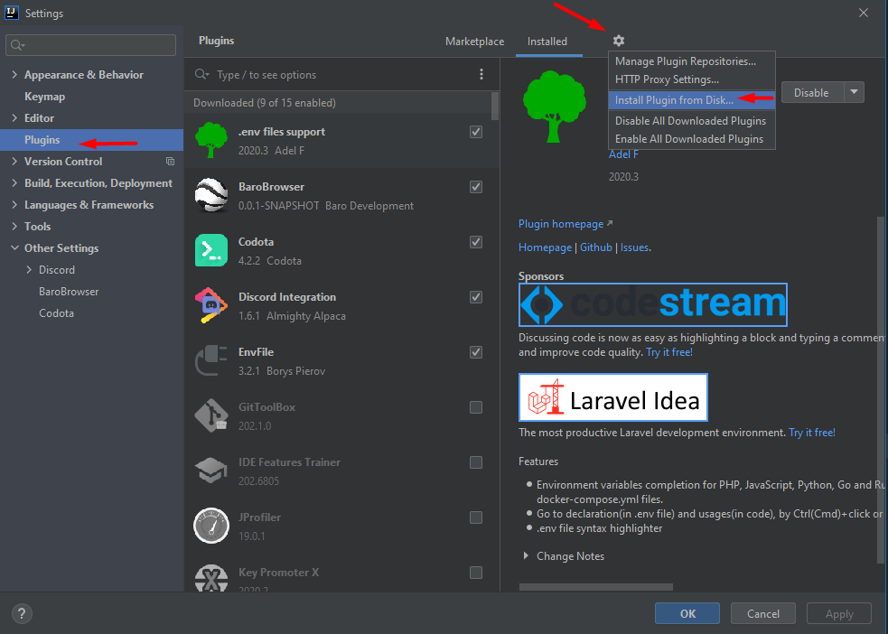

# Baro Browser

    

BaroBrowser is a IntelliJ IDEA plugin written in Kotlin
This plugin adds a tool window to IntelliJ plugins that opens the following apps inside JCEF

 
 
 
 
 

You need a JetBrains Runtime that supports JCEF. 2020.2+ Supports JCEF out of the box.

## Install

## Settings
Set your cache folder under `Settings -> Other Settings -> BaroBrowser`.
The plugin will put session cache data there, so you don't have to login everytime. 

## Screenshots
### Github

### Gitlab

### Youtube

### Discord
